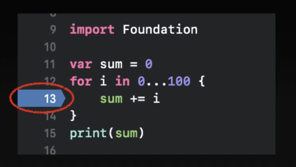
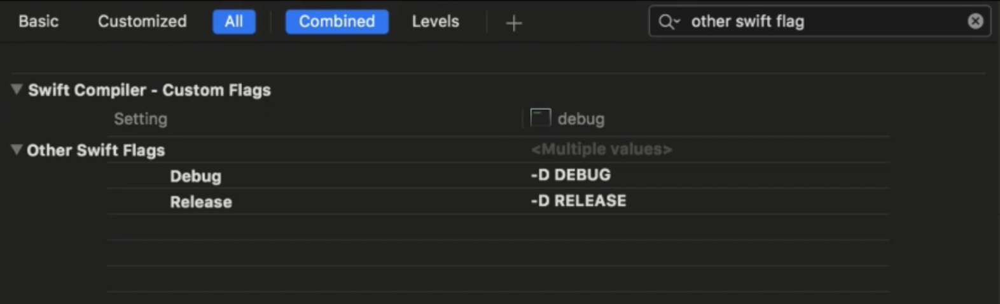
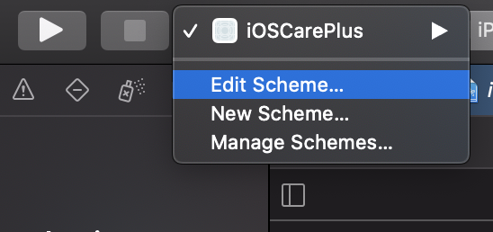
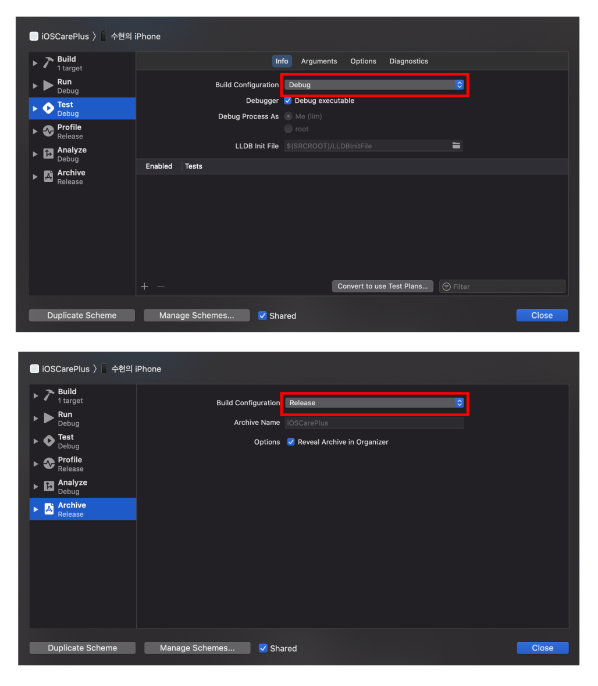

# iOSCarePlus
🎮 🛍 게임 스토어 앱 만들어보기( with: [Jercy](https://github.com/JeaSungLEE/iOSCarePlus) )

### 🍎 Used APIs
* https://ec.nintendo.com/api/KR/ko/search/new?count=30&offset=0

### 🍎 Used Libraries
* [Alamofire](https://github.com/Alamofire/Alamofire) : API 통신
* [Kingfisher](https://github.com/onevcat/Kingfisher) : 이미지 캐싱

---

## 🌸 .gitignore
* `.gitignore` 파일에 명시한 파일은 **git 변경 내역 추적에서 제외**한다.
* 협업 시 충돌을 방지하거나 불필요한 파일을 올리지 않을 수 있다.
* 주로 백업 파일, 로그 파일, 로컬 설정 파일 등이 포함된다.
* **XCode Swift 프로젝트에서는?** => *DS_Store, XCode Patch 관련, Dependency Manager 관련 등*
* `.gitignore` 파일을 추가하기 전에 commit을 했다면?
    ```
    git rm -r --cached [파일명]
    ```

### references
* https://github.com/github/gitignore : github 공식 레포
* https://gitignore.io : 간단하게 gitignore 파일을 만들어주는 사이트
---

## 🌸 SwiftLint
* **Swift 스타일 및 규칙을 적용하는 도구**
* 규칙에 어긋나는 코드 줄에는 Warning 또는 Error 발생

### SwiftLint 적용하기
* XCode File Navigator에서 `프로젝트 폴더` 클릭
* 기본 App `Target` 클릭
* `Build Phases`로 이동
* `+` 버튼 클릭
* `New Run Script Phases` 클릭하여 아래의 코드 추가
    ```
    if which swiftlint >/dev/null; then
        swiftlint
    else
        echo "warning: SwiftLint not installed, download from https://github.com/realm/SwiftLint"
    fi
    ```
* 방금 추가한 스텝의 위치를 `Compile Sources` 위로 이동한다.

### references
* https://github.com/realm/SwiftLint

---

## 🌸 SPM (Swift Package Manager)

### 의존성 관리 도구 Dependency Manager
라이브러리의 다운로드와 버전 및 의존성을 쉽게 관리해주는 도구
* **SPM (Swift Package Manager)**
    * **Apple 공식!** 앞으로 대부분 상용될 것이다.
    * 비교적 최근에 출시되어서 아직 지원하지 않는 라이브러리들이 있다.
* **CocoaPods**
    * 대중적이고 사용하기 편리하다. 대부분의 라이브러리를 지원하고 있다.
    * Workspace 환경에서 작업해야하며, 빌드 시간이 오래걸린다.
* **Carthage**
    * 잘 사용하지 않을 것이다...

### SPM 사용하기
* `File` > `Swift Packages` > `Add Package Dependency...`
* 원하는 라이브러리의 `repository 주소` 입력
* `version` / `branch` / `commit` 으로 선택 가능
* `package product` 선택
* XCode File Navigator에 `Swift Package Dependencies`를 보면 **라이브러리가 추가**된 것을 확인할 수 있다.

### references
* https://swift.org/package-manager/

---

## 🌸 CocoaPods
### 설치
```
sudo gem install cocoapods
````

### 사용 방법
* `pod init`  
    > Podfile이 생성된다.
    ```
    # Uncomment the next line to define a global platform for your project
    # platform :ios, '9.0'
    
    target 'test' do
        # Comment the next line if you don't want to use dynamic frameworks
        use_frameworks!

        # Pods for test

    end

    ```
    > 생성된 `Podfile`에 원하는 라이브러리 의존성을 추가한다.

    > line 2 : 플랫폼 버전 명시  
    > line 4 : 'test' -> 타겟 이름으로 설정  
    > line 5~9 : 라이브러리 의존성 추가

* `pod install`
    > 프로젝트에 `Podfile`에 적힌 라이브러리를 설치한다.

    > pod 라이브러리 설치 이후부터는 `.xcodeproj` 파일이 아닌, `.workspace` 확장자 파일에서 작업해야 한다.
* `pod update`
    > pod 라이브러리가 한 번 설치된 이후에는 `podfile.lock` 파일이 생성된다.

    > `pod update` 명령어는 이 `podfile.lock` 파일을 보고 라이브러리를 업데이트 한다.
* `pod repo`
    > 모든 프레임워크의 정보가 들어있다.
    
    > 최신버전 라이브러리일 경우, repo를 업데이트 하지 않으면 라이브러리를 못 받아오는 경우도 있다.

### references
* https://cocoapods.org/

---

## 🌸 Alamofire
* **비연결 HTTP 기반의 네트워크 통신 라이브러리**
* (Swift 자체 라이브러리 URLSession보다 사용법이 간단함)
* SPM, Carthage 또는 CocoaPods을 이용하여 설치
* `import Alamofire`

### request
* **AF.request(**_: method: parameters: encoder: headers: interceptor:**)**
* 사용 예시
    ```
    AF.request(url).responseJSON { response in
        guard let data: Data = response.data else { return }
        let decoder: JSONDecoder = JSONDecoder()
        
        // 디코딩 및 데이터 처리
        // ...
    }
    ```
### http method 종류
* .get
* .post
* .put
* .delete 
* 등...

### references
* https://github.com/Alamofire/Alamofire

---

## 🌸 Kingfisher
* 이미지 캐싱 라이브러리

### 이미지 캐싱이란?
* 네트워크 통신 시 이미지를 가져오는 것은 빈번하고, 상대적으로 비용이 많이 든다.
* 따라서 이미지를 한번 받아올 때 캐시 메모리에 저장해두면 자동으로 캐시에서 삭제되기 전까지는 빠르게 처리할 수 있게 된다.

### 사용 방법
```
let url: URL? = URL(string: "https://example.com/image.png")
imageView.kf.setImage(with: url)
````

### references
https://github.com/onevcat/Kingfisher

---

## 🌸 인증서
* iOS 개발을 하기 위해서는 개발자 계정이 필요하다.
* App Store에 앱을 배포하기 위해서는 개발자 계정이 필요하다.
* 여러사람이 하나의 프로젝트에서 협업할 때, 인증서 공유가 필요하다.

### 인증서 종류
* 계정에 대한 인증서 : `.csr`, `.cer`, `.key`, `.p12`
    * `.csr` 파일을 통해 `.cer` 파일을 만든다.
    * `.cer` 파일에서 `.key` 파일이 자동으로 생성된다.
    * `.key` 파일을 통해 `.p12` 파일을 내보내기할 수 있다.
    * `.p12` 파일을 통해 `.cer` + `.key`가 조합된 파일을 얻을 수 있다.
* 기기 정보 등의 다양한 정보를 포함 : `PP (Provisioning profile)`
* 푸시 인증서 : `.p8`

### 인증서가 필요한 이유
* XCode에서 Target의 `Signing & Capabilities`를 보면 Team은 프로젝트를 생성한 사람의 계정으로 되어있고, Automatically에 체크가 되어있다. 그러면 한 대의 실 디바이스로만 테스트할 수 있다. 

* 팀원 모두가 각자 폰에서 빌드를 하려면 2가지 방법이 있다.
    1. 프로젝트에 팀원 모두의 계정을 등록해주기
        * XCode > Preferences > Accounts
        * 계정을 직접 공유하는 방식이기 때문에 그렇게 좋은 방법은 아님..
    2. 인증서를 공유하기
        * 원래는 Automatically에 체크가 되어있어서 자동으로 Provisioning Profile이 생성되는 것이다.
        * 여러 대의 기기에서 빌드하고 싶으면 Automatically 체크를 해제하고, 인증서(`.p12`)와 Provisioning Profile(`.mobileprovision`)을 공유하는 방식으로 사용하면 된다.


### Apple Developer 사이트  
[이곳](https://developer.apple.com)에서 인증서를 발급하고, 관리할 수 있다.  
* **Certificates**: 내 계정에 관한 인증서
* **Identifiers**: 앱 번들 ID 등록
* **Devices**: 개발용 디바이스 등록
* **Profiles**: Certificates + Identifiers + Devices를 묶은 파일 


### Certificates
내 계정에 대한 인증서를 만드는 과정이다. 이 인증서를 가지고 있는 사람은 내가 인증한 사람이다 라는 뜻!
1. `.cer` 파일 만들기
    1. Certificates 제목 옆에 있는 `+` 버튼을 누른다
    2. 종류를 선택해준다
        * ✅ Apple Development ✅ : 개발용! XCode에서 디버그 상태에서 사용
        * Apple Distribution : 앱스토어 업로드 용
    3. `Signing Request`를 업로드 => `.csr` 파일 (Mac에서 생성)
        1. Keychain Access(키체인 접근) > 인증서 지원 > 인증 기관에서 인증서 요청
        2. 이메일 주소 적고 이름 적고 `계속`을 누른다.
        3. `.certSigningRequest` 파일이 생성된다. 원하는 곳에 잘 저장해두기~
        4. 저장한 파일을 올려주면 된다.
    4. 개발 인증서 만들기 성공! 
        1. Download 받으면 `.cer` 파일이 다운된다.
        2. 다운로드 받은 `.cer` 파일을 더블클릭하면 **키체인**에 인증서가 등록된다.
        3. 다운로드 받은 `.cer` 파일에서 **스페이스바**를 누르면 미리보기에 `Apple Development: <사용자명> (인증서일련번호)`를 확인할 수 있다.
        4. 저 **인증서 일련번호**와 **키체인 이름**이 같아야 함!!
2. `.key` 파일 => cer 파일과 key 파일까지 일치해야 인증에 성공할 수 있다.
    1. Keychain Access(키체인 접근) > 인증서 탭 > 방금 만든 인증서의 토글 화살표를 누르면 `KEY`가 나온다.
    2. 우클릭 > 내보내기 > 이름 별도저장 ("개발용인증서"와 같은 이름으로 변경해준다.) > 파일 포맷 지정 (`.p12`) > 암호는 넣어도, 안넣어도 된다.
3.  `.p12` 파일을 공유하세요!
    1. 공유받은 사람이 `.p12` 파일을 더블클릭, 암호를 넣으면 Mac에 자동으로 인증서가 등록됩니다.

### Identifiers
등록하면 다른 사람이 같은 Bundle ID의 앱을 등록할 수 없게 된다.
1. `+` 버튼 클릭
2. **App IDs** 선택
3. **App** 선택
4. **Description** 적어주기
5. **Bundle ID / Explict**
    - XCode 프로젝트에 적혀있는 Bundle ID를 넣어준다.
6. **Capability** 추가
    - 처음에 안해도 나중에 추가할 수 있다.
    - 변경사항이 생기면 다시 `PP` 파일을 만들어야 하긴 함


### Devices
팀원이 여러명일 경우, 모든 기기들의 UDID를 다 등록해 주면 된다.
1. `+` 누르기
2. 플랫폼 선택 / 디바이스 이름 / UDID 등록
    * **UDID 확인하는 법** : 핸드폰을 맥에 연결 > 기기 이름 아래의 상세정보를 클릭하다보면 일련번호와 **UDID**가 나타남!

### Profile
위에서 했던 과정을 모두 합쳐보자.
1. **종류 선택** : (개발용) Development > iOS App Development 선택
2. **App ID** : 위에서 만든 Identifiers를 선택
3. **인증서 선택** : 아까 만든 인증서(`.p12`)를 선택하면 된다. (3개까지 가능)
4. **기기 선택** : 등록한 팀원들 기기를 모두 선택해준다.
5. **PP 파일 이름 등록**
6. 다운로드 받으면 `.mobileprovision` 파일을 받을 수 있다.
    * 이렇게 다운받은 파일을 클릭하면 자동으로 XCode에 들어간다!

> PP 파일에 변경(Devices, Capability 등)이 생겼을 경우, Edit을 통해 수정하고 다시 다운로드 받아야 한다. 다운로드 받고 다시 클릭하는 것도 잊지 말자!

### 팀원이 XCode에 등록하는 법
* 인증서 `.p12` 파일과 PP `.mobileprovision` 파일을 공유받았다면, 두 파일 모두 더블클릭해서 실행만 시켜준다면 자동으로 등록된다.
* XCode에서 `Automatically manage signing` 체크를 해제하고, `Provisioning Profile`을 잘 선택해준다.

### references
https://developer.apple.com

---

## 🌸 디버깅

### Break Point 걸기
* 해당 라인을 빌드하면 프로그램이 현재 상태를 유지하면서 잠시 멈춤

* 디버그창의 왼쪽에는 **stack에 쌓여있는 데이터 값**을 볼 수 있고 오른쪽에는 **lldb 디버거**가 있다.

### lldb
* XCode 내장 디버거 (debugger)
* 매번 빌드하기 힘들 때 테스트용으로 쓰면 편리함.
* [명령어 모음](lldb.llvm.orf/lldb-gdb.html)
    * `p`, `print` : 데이터 출력
    * `po` : 객체화 시켜서 예쁘게 출력
    * `e`, `expr` : stack의 값을 임시로 변경 (시뮬레이터에도 반영됨)
    * `e let $` : $ 뒤에 오는 것을 이름으로 갖는 변수 선언 

### Swift Flags

* Debug 상태일 때, Release 상태일 때와 같이 Configuration을 구분해서 컴파일 할 코드를 분기할 수 있다.

    ### Other Swift Flags
    * Build Settings > All / Combined > Other Swift Flags
    * 왼쪽에는 Configuration을, 오른쪽에는 코드에 사용될 키워드를 작성하고 앞에 -D를 붙여준다.
    
    * 코드에서는 `#if <키워드>` ~ `#endif` 를 사용하여 분기할 수 있다.


    ### Scheme
    * Flag로 사용된 Debug, Release와 같은 Configuration에 따라 빌드 방식을 구분하는 방법이다.
    * 일반적으로 Scheme에는 Run과 Archive, Test 등이 있고,  
    `Run`의 Configuration은 **Debug**, `Archive`의 Configuration은 **Release**이다.

    * XCode 상단에 있는 `▶️`(Run) 버튼 오른쪽에 있는 **타겟**을 클릭하고 `Edit Scheme...`을 클릭한다.
    

    * Build Configuration을 살펴보면 Run은 Debug, Archive는 Release이다.
    

    * `#if DEBUG` ~ `#endif` 부분의 코드는 Run으로 컴파일할 때 실행되지만, Archive로 컴파일할 때는 실행되지 않는다. 

```
import Foundation

var sum = 0
#if DEBUG
for i in 0...10 {
    sum += i
}
#endif

print(sum)

```
> Debug :: 55 출력  
> Release :: 0 출력